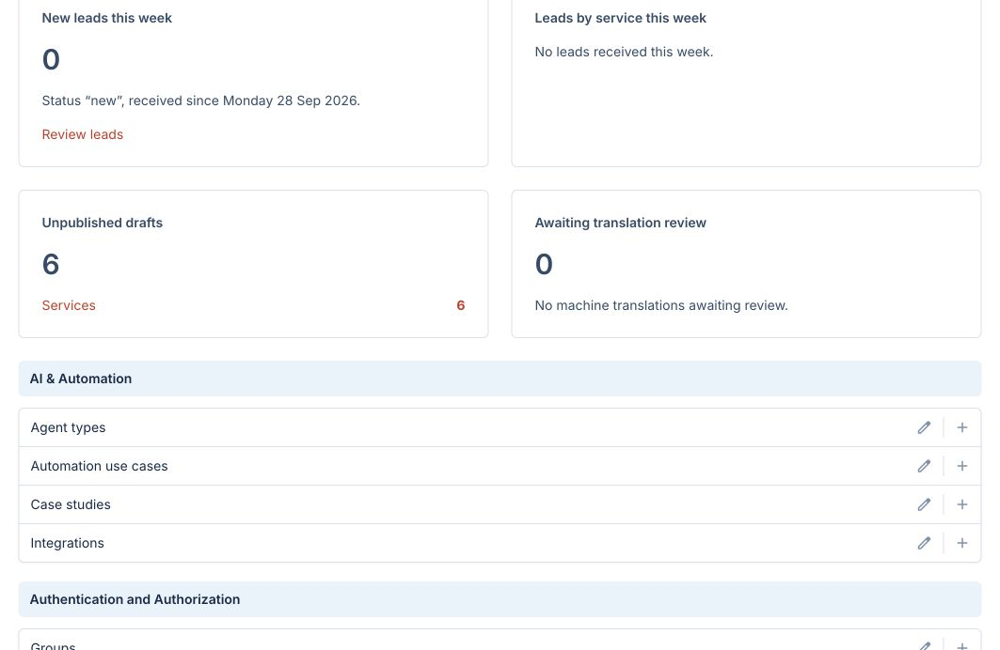
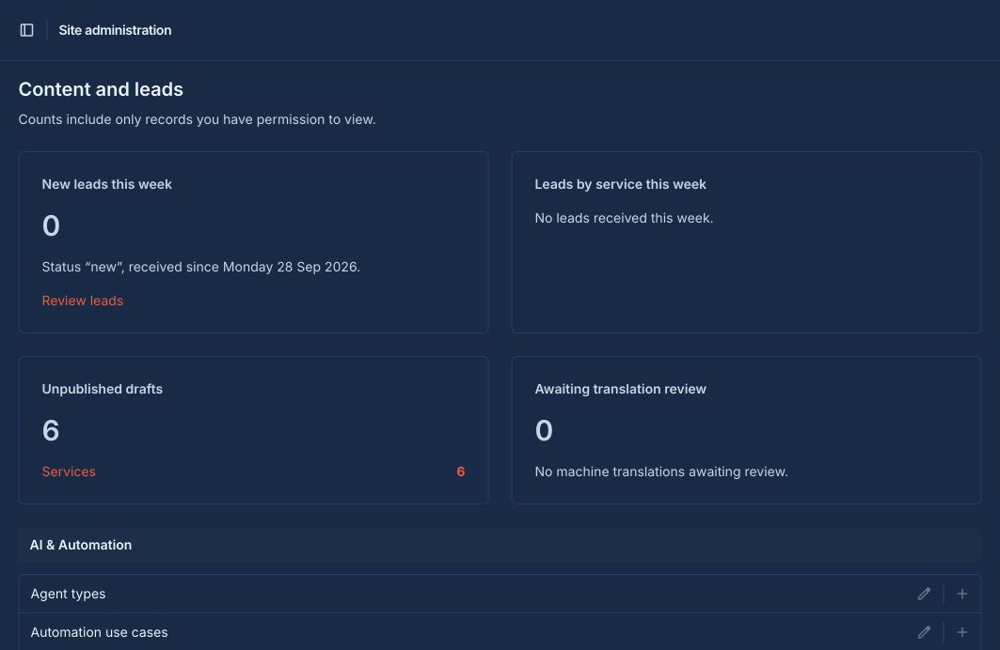
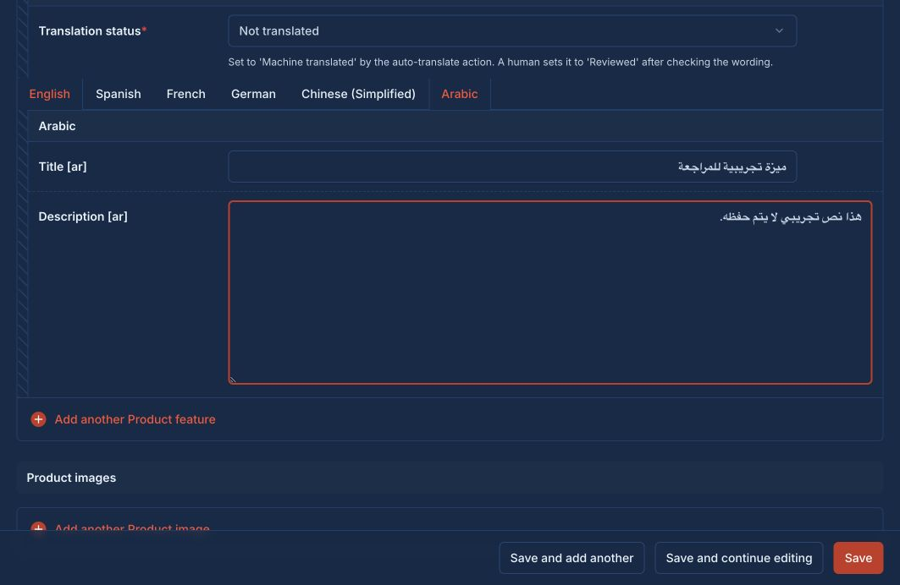

# Phase 2 checkpoint

Ready for review on October 2, 2026. Implementation commit: `882d55c`.
Phase 3 has not started. No new dependencies were added.

## Implemented

| Area | Ready to edit in the admin |
|---|---|
| Products | Product details, translated features, image gallery, service/tool/industry relations |
| Portfolio | Case studies, translated metrics and gallery, six service-specific proxy screens |
| Digital Marketing | Campaigns, platforms, creative work and social channels |
| AI & Automation | Use cases, agent types and integrations |
| Custom Software | System types and database capabilities |
| Web Development | Web capabilities |
| Mobile Development | App listings, platform selection and translated screenshots |
| Cyber Security | Security services, compliance standards and certifications |
| Blog | Posts, authors, categories and tags |
| Shared media | Portrait/landscape video with YouTube, Vimeo or uploaded MP4/WebM sources |
| CRM | Private leads, notes, statuses, attribution, newsletter subscribers and staff email alerts |
| Dashboard | New leads this week, weekly leads by service, drafts and translation-review counts |

All translatable forms and inlines have six language tabs with English fallback and RTL Arabic
inputs. Long-form HTML is sanitized in every locale. Products, case studies and posts include SEO
fields. Publishing excludes drafts and machine translations. No real client claims, metrics,
certifications, leads or demo products were inserted into the development database.

Each service-specific case-study screen filters object lookups and fixes the service on save.
Changing a submitted service ID cannot move a record into another service through that screen.

## Decisions

- `MobileApp.features` is plain text, one feature per line.
- Videos may stand alone or belong to **one** service, product or case study. Database constraints
  enforce ownership and source/file consistency. Hosted videos require the selected host over HTTPS.
- Editorial reference content also uses the shared draft/review gate. Child features, galleries,
  metrics, categories and tags retain their own translation-review status. Phase 4 serializers must
  apply the parent publication gate and exclude machine-translated children.
- Uploaded images are decoded and their format checked against the extension. MP4/WebM uploads
  receive container-signature, extension and size checks; this is not a full video decoder or
  malware scanner. Filenames are replaced with UUIDs. The existing upload limit applies.
- Dashboard weeks start Monday in the configured Django `TIME_ZONE`. Lead-by-service totals cover
  all statuses received that week; “new leads” counts only records still in `new` status.
- Dashboard counts obey staff model permissions and do not double-count case-study proxies.

## Lead alerts

Set `LEAD_ALERT_RECIPIENTS`, SMTP environment values and `ADMIN_BASE_URL` in the local backend `.env`.
`ADMIN_BASE_URL` is the backend origin, without `/admin/`; `EMAIL_TIMEOUT` defaults to ten seconds.
When SMTP is unset, development uses Django's console email backend.

New leads trigger an alert **after their database transaction commits**. Email contains the record
ID and authenticated admin link, not the customer's message, contact details or internal notes.
Updates do not send new alerts. Successful delivery records `alert_sent_at`; failures keep the lead
and can be retried with **Leads → select records → Retry unsent lead alerts**.

Delivery is synchronous and best effort, with no background queue. A process failure between SMTP
acceptance and recording success can cause a duplicate on retry. Newsletter confirmation records
are supported; subscription APIs and confirmation delivery are not part of this phase.

Automated tests use an in-memory email backend and simulated SMTP failures. **Live SMTP delivery
has not been verified, and no test email was sent to a real recipient.**

## Verification

- **106 backend tests passed**, including 24 new Phase 2 tests.
- Every new admin list and add form renders; six service-specific case-study forms save correctly.
- Actual admin POST tests cover products, translated features/galleries, case-study metrics, mobile
  screenshots, blog tags/body, and videos. Image tests use temporary storage.
- Checks cover cross-service object access, publish/review gates, HTML sanitization in all six
  locales, invalid uploads, date/rating constraints, email commit/rollback/retry behavior,
  case-insensitive subscriber uniqueness, and restricted staff access.
- `ruff check`, `ruff format --check`, Django system checks, production `check --deploy`,
  migration drift check and `git diff --check` passed.
- New migrations applied successfully to the local development database.
- Frontend `npm run build`, `npm run lint` and `npm run typecheck` passed.
- Browser: dashboard inspected in light/dark; newly added product-feature inline edited in Arabic
  with RTL alignment. Unsaved browser sample text was discarded. No admin console errors observed.
- Existing frontend `/en` and `/ar` inspected in light/dark; correct direction, canonical metadata
  and seven language alternates confirmed. This remains the Phase 1 scaffold.
- Staged implementation scanned against local secret values and common credential patterns;
  no matches or secret filenames found.

Temporary review servers on ports 8001 and 3001 were stopped. An already-running process on port
8000 was left untouched.

## Run and review

From the repository root, in one terminal:

```bash
cd backend
source .venv/bin/activate
python manage.py migrate
python manage.py runserver 8000
```

Open <http://127.0.0.1:8000/admin/> with your existing local admin account. If port 8000 is occupied,
use `python manage.py runserver 8001` and open <http://127.0.0.1:8001/admin/>.

In another terminal, from the repository root:

```bash
cd frontend
npm run dev
```

Open <http://localhost:3000/en> or <http://localhost:3000/ar>.

Review these workflows:

1. Dashboard: inspect the four counters and follow the draft link.
2. Products: create a draft; add a feature/gallery row; switch English/Arabic; save and reopen.
3. Each service group: open its case-study screen and confirm only that service's records appear.
4. Media: add a hosted video, choose orientation, and check the error for conflicting owners/sources.
5. Mobile: choose iOS/Android and add a screenshot; Blog: select an author/category and edit body text.
6. Leads: inspect the private fields and status workflow. Creating a lead sends an alert if recipients
   are configured; leave recipients empty for a review without email delivery.

## Phase boundary

Groq actions and translation logs are Phase 3. Public API endpoints, Turnstile and demo seeding are
Phase 4. Frontend shell/pages follow in Phases 5–6; launch SEO/performance/accessibility is Phase 7.
Wait for explicit approval before starting Phase 3.

## Screenshots






