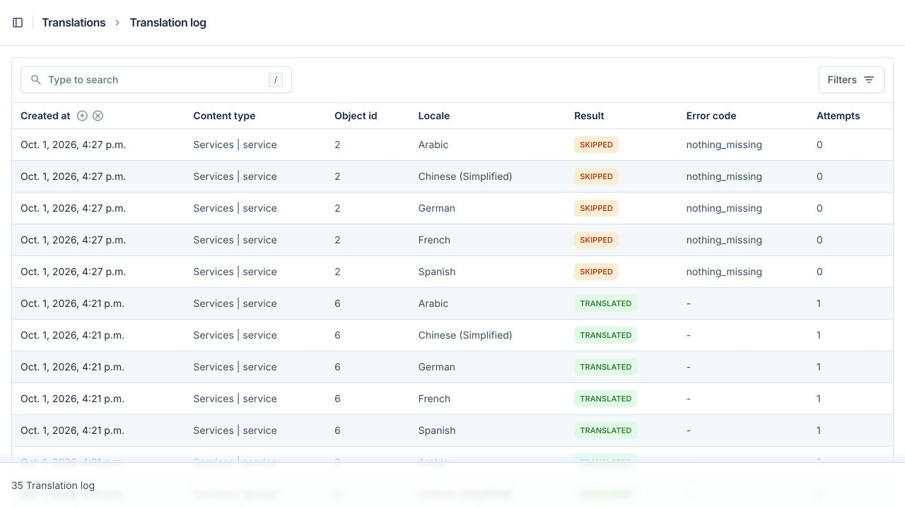
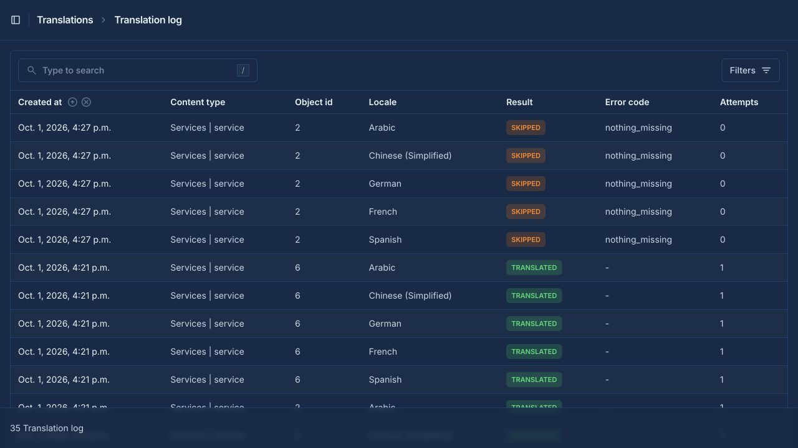
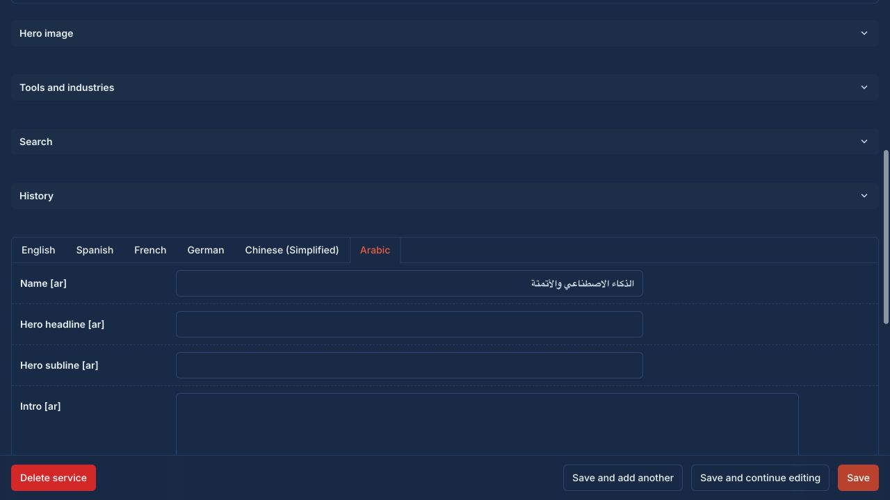
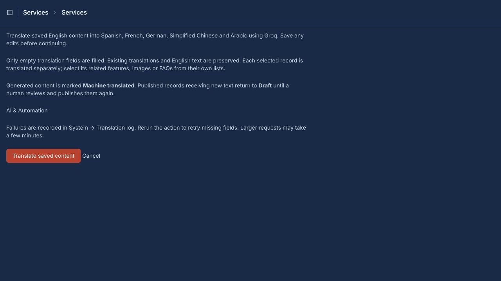

# Phase 3 checkpoint

Implemented for review on October 2, 2026. Phase 4 has not started.
Implementation: `dd517e2`; inline-panel fix: `0b5e045`. Commits are local, not pushed.
Read the [live translation samples](PHASE_3_TRANSLATION_SAMPLES.md) before approving output quality.

## What changed

- `apps.translations`: Groq client, translation service, audit model, read-only admin and migration.
- Bulk **Auto-translate to all languages** action and saved-record action on translatable content.
  Both show a confirmation page before contacting Groq. Related children use their own actions.
- Saved English is the source. Only blank Spanish, French, German, Simplified Chinese and Arabic
  columns are filled; modeltranslation fallback never masquerades as saved text.
- Each response must have the exact field keys, string values and complete JSON. The batch is
  validated before saving: length, plain/rich text, HTML tags/nesting/attributes, links and numbers.
  Known protected names use opaque placeholders; restored text is validated again. Other proper
  nouns rely on model instructions and human review.
- Row locking and source/target rechecks preserve edits made while a provider request is running.
- New text sets `translation_status=machine` and returns publishable content to `draft`.
  Existing public query gates continue to exclude machine translations.
- Audit entries record model/object, locale, field names, actor, run ID, model name, attempts,
  outcome and fixed error code. No source text, generated text, raw provider response or key is logged.
- Transient errors retry with backoff. Long Retry-After responses stop the run safely. Repeat the
  action to retry missing fields; completed translations are preserved.
- A CLI supports explicit content models and record IDs, including selected locales.
- Fixed an existing translated-inline template error: native top-level details panels no longer
  evaluate Alpine's missing `open` state. Nested panels retain their scoped state.

No new dependencies were added. No public API or frontend feature was introduced in this phase.

## Configuration and limits

Set `GROQ_API_KEY` only in the ignored backend `.env`. The example contains no credential.
The old configured `llama-3.3-70b-versatile` model was retired according to the
[Groq deprecation page](https://console.groq.com/docs/deprecations).
The new default `qwen/qwen3.8-27b` was verified through the account's model list and live requests.
It is a [preview model](https://console.groq.com/docs/model/qwen/qwen3.8-27b); check availability and
choose a supported production model before launch. Configuration remains environment-driven.

Defaults in `.env.example`:

| Setting | Default |
|---|---|
| GROQ_MODEL | qwen/qwen3.8-27b |
| GROQ_API_URL | https://api.groq.com/openai/v1/chat/completions |
| GROQ_TIMEOUT | 20 seconds per network operation |
| GROQ_MAX_ATTEMPTS | 3, with a hard cap of 5 |
| GROQ_RETRY_MAX_SECONDS | 15 seconds |
| GROQ_BATCH_CHARS | 6000 source characters per batch |
| GROQ_MAX_COMPLETION_TOKENS | 4096 ceiling; smaller requests use smaller budgets |
| TRANSLATION_ADMIN_MAX_RECORDS | 3 |

The client allows only Groq HTTPS and refuses redirects, so authorization headers cannot follow
an unexpected host. Delivery is synchronous and sequential, with no durable background queue or
global rate scheduler. Larger records can take minutes and may exceed a production proxy timeout;
use the CLI for those runs. A single field over the batch limit fails with `source_too_long`; adjust
the limit and token budget together or translate it manually. Nothing is silently truncated.
HTML/proper-name validation is deliberately strict and can reject fluent but structurally changed
output. Rejected batches remain blank and can be retried or edited manually.

## Verification

- **135 backend tests passed**: the existing 106 plus 29 translation tests.
- Coverage includes all target languages, missing-only behavior, human/concurrent edit protection,
  draft/review gates, HTML mutation, provider retries and malformed/incomplete responses, batching,
  oversized fields, configuration failures, permissions, CSRF, proxy ownership, read-only logs and CLI.
- Ruff lint/format checks, migration drift, production Django deployment checks and diff checks pass.
- TranslationLog migration applied to local PostgreSQL. Frontend production build passed.
- Live translation: AI & Automation and Cyber Security names saved successfully in all five languages.
  One successful batch needed two attempts. Both records remain draft/machine.
- A separate factual HTML sample passed validation in all five languages. It was not saved as new
  website copy. Automated validation checks structure, not native-speaker fluency.
- Initial provider failures remain in the local audit history, followed by successful runs. No
  existing text was lost. Browser rerun of AI & Automation showed 0 saved, 0 failed, 5 skipped.
- Browser checked confirmation, action links, Arabic text and RTL input, audit log in light/dark,
  and inline expansion. No new console errors occurred after correcting the inline template.
- Staged implementation was scanned against local secret values and common credential patterns:
  no matches. Environment files and Git backup bundles are excluded.

## Run and review

From the repository root:

```bash
cd backend
source .venv/bin/activate
python manage.py migrate
python manage.py runserver 8001
```

Open <http://127.0.0.1:8001/admin/> using your existing local admin account.
Temporary verification servers were stopped after review; the existing port 8000 process was left
untouched. No new frontend setup is needed for this phase.

1. Open **Services → All services → AI & Automation** and check all five non-English tabs.
2. Repeat for **Cyber Security**, especially the German terminology choice noted in the samples.
3. Select either record and run **Auto-translate to all languages**. Confirm that existing fields
   stay unchanged and the log records skipped fields when nothing is missing.
4. For new English content, save first, then use the record action. Review generated text in each
   language before setting **Reviewed by a human**. Publishing is a separate human decision.
5. Open **System → Translation log**. Failed entries explain the next step; open the source record
   to retry missing translations. The audit log itself cannot be edited or deleted from admin.
6. Translate related offerings, features, FAQ answers and gallery captions from their own lists.

CLI example, from backend with the venv active (uses this local sample record ID):

```bash
python manage.py translate_content services.Service 2 --locale ar
```

Changing English does not overwrite existing translations. An editor must clear a target field
intentionally before requesting a new translation. Review status is per record, not per field.

## Configuration troubleshooting

If every locale fails with `configuration` and zero attempts, no provider request was made.
Check the server environment and fully restart Django after editing `.env`: stop the original
`runserver` with Ctrl+C, then start it again. A browser refresh is not enough. Django's reloader
parent can pass its old environment into replacement child processes even after code changes.
Do not make `.env` silently override deployment environment variables to work around this.

The October 2 follow-up traced the reported five failures to an old running server configuration.
A fresh process loaded the current model/key, and the user-approved team-member retry saved all
five locales on the first attempt. Existing translations were preserved. The record remains
machine-translated pending human review. The admin now explains configuration failures and the
restart requirement directly; the same guidance appears in the audit log. Thirty translation
regression tests and the frontend build passed for this follow-up.

## Evidence









## Phase boundary

Stop here for the user's language-quality review. Phase 4 APIs, Turnstile and demo seeding require
explicit approval. Earlier phase reports remain historical snapshots.
