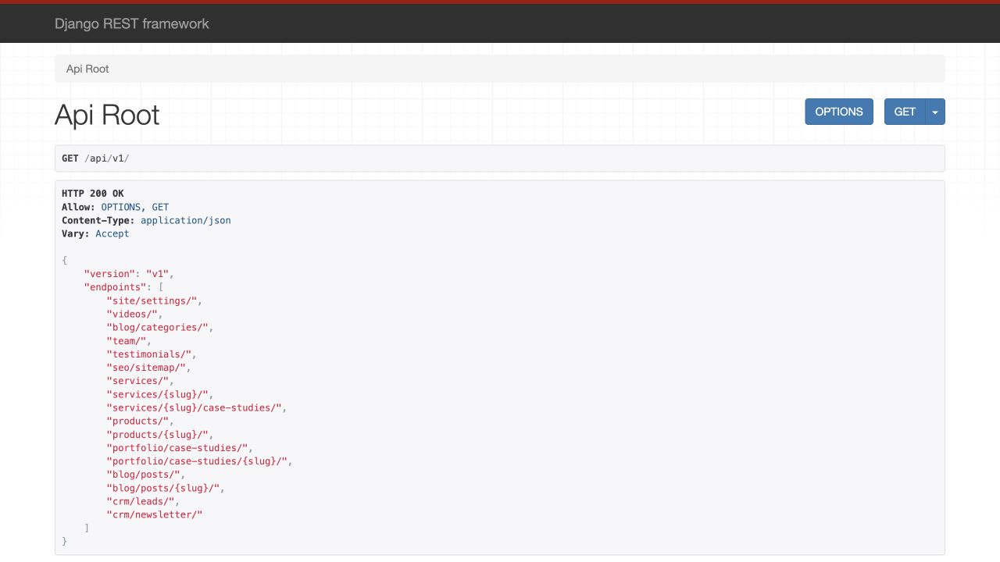
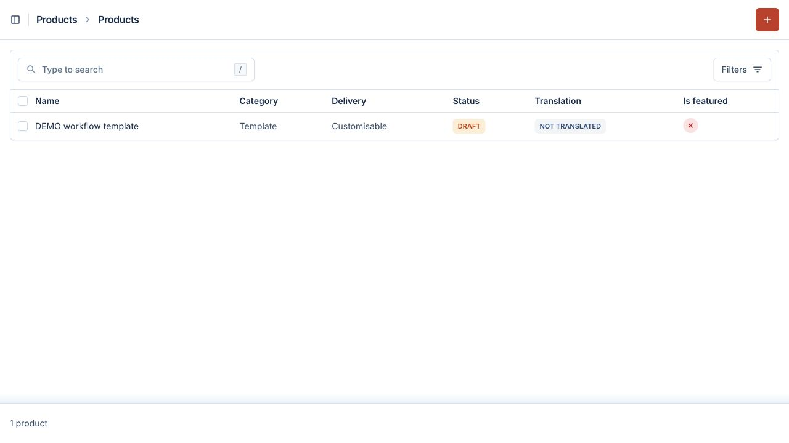

# Phase 4 checkpoint

Ready for review on October 2, 2026. Phase 5 has not started.
Implementation commit: `358eb84` (local, not pushed).
The [API contract](API_V1.md) documents every endpoint, response shape, filter and capture field.

## Delivered

- Every read/write endpoint listed in BUILD_PROMPT.md is now routed under `/api/v1/`.
- Explicit field serializers resolve six locales with saved-English fallback. Public queries and
  nested relations exclude draft, inactive and machine-translated content according to each model.
- Full service payloads include shared sections and all six service-specific content families.
  Products, portfolio and blog have detail views, filters and fixed-size pagination.
- Public video owners are checked; internal staff/CRM fields never enter public responses.
- The sitemap feed includes all locales and language alternates while excluding hidden/noindex pages.
- JSON ETags allow revalidation without retaining stale published content at the API layer.
- Lead and newsletter POSTs have validation, honeypots, atomic shared per-IP throttling and
  server-side Turnstile verification. Capture responses never echo personal details or IDs.
- Lead creation uses the existing after-commit staff alert. Newsletter writes are case-insensitive,
  idempotent and unconfirmed, with identical responses for existing/new addresses.
- The development-only `seed_demo` command inserts labeled placeholders as drafts. It does not
  overwrite company facts, existing content, translations or publication settings.

No new dependencies were added. PostgreSQL provides the rate-limit counter storage. The public
frontend remains the earlier scaffold; layout, navigation and real pages belong to Phases 5–6.

## Verification

- **165 backend tests passed**, including 29 new Phase 4 tests.
- All documented routes, allowed methods, filters, pagination and English/Arabic/other-locale
  fallback exercised through real Django/DRF requests against PostgreSQL.
- Parent and child review gates, hidden video owners, private phone switch, hidden author/category/
  tag/industry references, noindex sitemap exclusion and ETag changes on unpublish verified.
- Query-count regression confirms adding service-related case studies/use cases does not create
  per-record queries.
- CRM tests cover input tampering, invalid fields, honeypot behavior, token failure/unavailability,
  duplicate subscriptions, email after commit, and forwarded-header spoofing.
- Twelve concurrent requests allowed exactly five through the shared PostgreSQL throttle.
- Cloudflare's public pass/fail/spent-token test credentials produced the expected live responses
  in an isolated probe. Production hostname/action checks were not relaxed.
- Frontend `npm run build` passed (including lint/type validation). Backend Ruff lint/format,
  migration drift, Django production deployment checks and Git diff checks passed.
- The throttle migration was applied locally. Running seed_demo created **45 records**; a second
  run created **0**, while existing records remained unchanged and unpublished.
- Browser: API discovery shows the new routes; Arabic services correctly returns an empty array
  while services are drafts; the admin shows the labeled draft product.
- Staged implementation was scanned against local credential values and token/key patterns before
  committing. No matches found; local environment files are excluded.

The original concurrency test initially left worker database connections open during test cleanup;
its worker teardown was corrected and the complete suite subsequently passed cleanly.

## Curl follow-up

The [curl verification report](PHASE_4_CURL_CHECK.md) records real HTTP requests, successful inserts
in a disposable test database, and the expected 503 responses with the current missing Turnstile
key. No application defect was found in the tested POST flows.

## Demo behavior

The command seeds one product with a feature; six placeholder case studies and metrics;
offerings/process/FAQs under draft services; one inactive demo author/category/tag/post; and
representative campaign, automation, agent, integration, system/database, web/mobile and security
records. Draft services already seeded from real company facts are not rewritten or auto-published.
Services already published are skipped when adding demo child content.

It does not invent real customers, case-study results, media, certifications, staff, newsletter
subscribers or leads. Demo names/slugs are reserved command identities: keep them stable if you
want repeated runs to find the same records. Editing their prose is preserved. The demo category
has no draft flag in the existing model and is visibly labeled DEMO in the category list; the demo
author stays inactive, and all publishable demo records stay draft.

## Run and review

From the repository root:

```bash
cd backend
source .venv/bin/activate
python manage.py migrate
python manage.py seed_demo
python manage.py runserver 8000
```

Open <http://127.0.0.1:8000/admin/> using your existing local account, and the
[API discovery page](http://127.0.0.1:8000/api/v1/). Use port 8001 if 8000 is occupied.
Temporary browser-verification servers were stopped; an existing user server was left untouched.
Fully restart your own server after environment edits, rather than relying on automatic reload.

1. Products: open **DEMO workflow template** and inspect its feature and draft status.
2. Each service group: inspect its demo content and the placeholder case study.
3. Services: save approved text in a language tab. Review translations before publishing.
4. For a local API demonstration, you may publish a demo product manually, inspect
   `/api/v1/products/demo-workflow-template/?lang=ar`, then return it to Draft. Its empty Arabic
   fields fall back to English. Do not publish placeholders on the real site.
5. Published services appear at `/api/v1/services/`; their full payload is at
   `/api/v1/services/{slug}/?lang=ar`. A draft or machine-translated row returns 404 even to admins.
6. Try product/blog/portfolio filters and inspect `/api/v1/seo/sitemap/`.
7. CRM GET endpoints must return 405. Configure Turnstile before testing a real POST; follow the
   request shapes and widget actions in API_V1.md. Avoid generating test mail to real recipients.

## Configuration and remaining limits

**The real Turnstile secret is not configured locally.** The code fails closed with 503 until it is
set. A real browser widget test awaits that key and the frontend form phase. Live SMTP delivery
also remains unverified; automated tests use an in-memory mailbox.

Configure the exact widget hostname allowlist and trusted direct proxy addresses as documented in
API_V1.md. Rate limits use fixed windows (default 5/hour per endpoint/IP); they are application spam
controls, not a replacement for edge traffic limits. Expired counters can be removed with
`python manage.py prune_capture_throttles`; scheduling it remains a deployment step.

Newsletter confirmation delivery, Next.js publish webhooks, frontend ISR invalidation and public
page UI are not part of this phase. API publication checks happen immediately; existing Next.js
caches will need the Phase 6 revalidation workflow. Sitemap lastmod currently tracks the page row,
not a separately edited nested child's timestamp.

## Screenshots





Stop here for user review and explicit approval before Phase 5.
