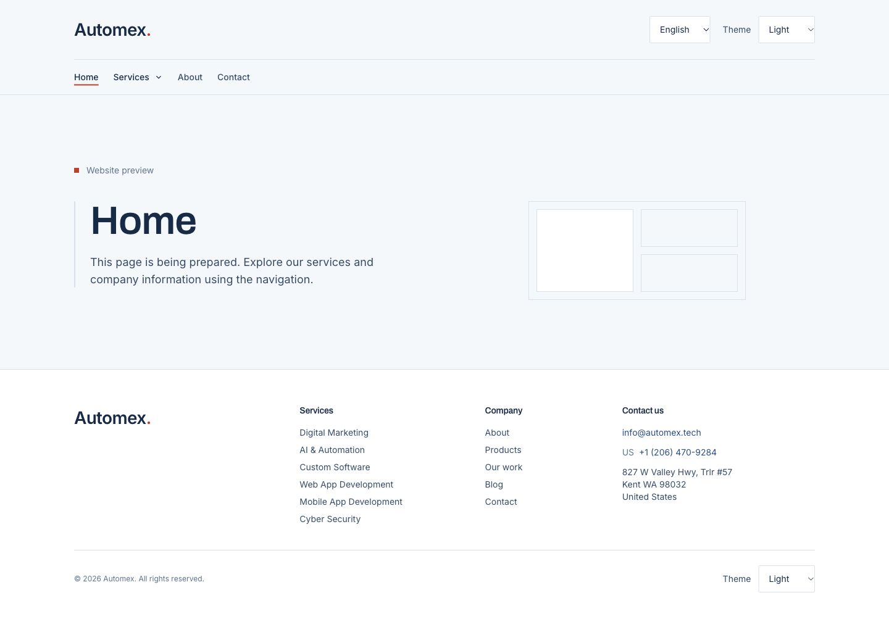
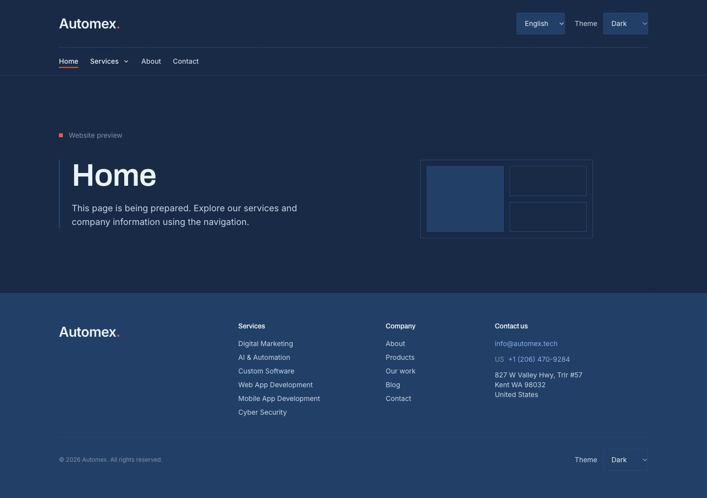
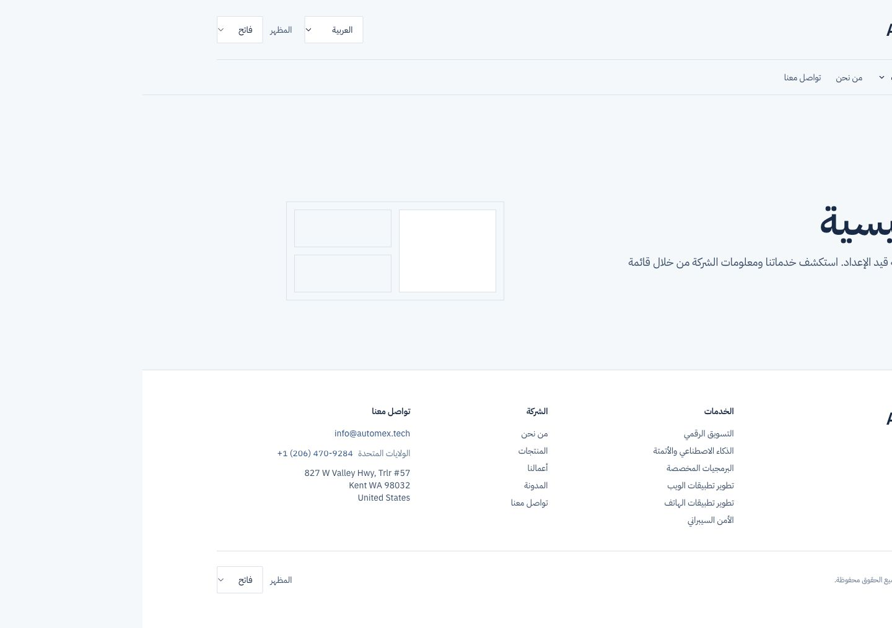
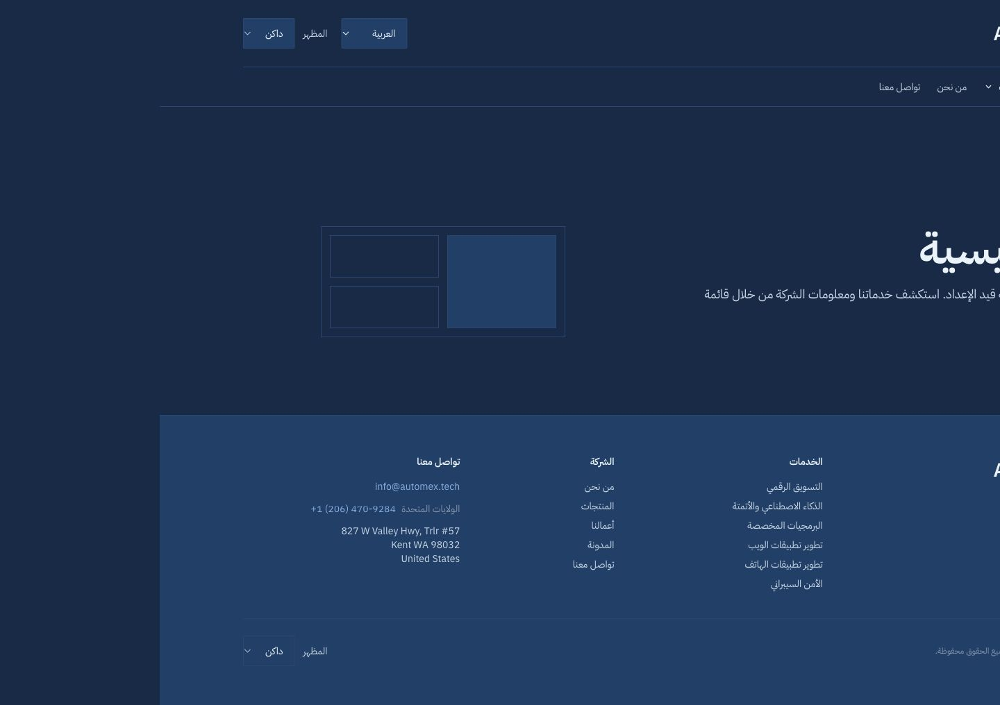

# Phase 5 — Frontend shell

October 2, 2026. Ready for user review; Phase 6 has not started.

## Delivered

- Shared server-rendered header and footer, using the public Django API for company facts and
  published service descriptions. Empty social links and the private Afghanistan phone stay hidden.
- All nine specified top-level links on wide desktops (1760px and above). Smaller widths use
  Home / Services / About / Contact, with all six services and a separate products column in
  the mega-menu. Work, Blog and Products remain in the footer, outside the nine-item top bar.
- Native disclosure menus with keyboard access, Escape, outside-click and focus-leave dismissal.
  Link selection closes the menu. Skip link, active-page indication and visible focus rings.
- Six translated UI locales. Switching language preserves the pathname, query and fragment.
  Arabic mirrors layout while the wordmark, email, phone and English address retain their direction.
- Light / dark / system theme controls with persisted selection. Existing Blueprint semantic tokens
  retained. Corrected CSS cascade layers so base rules no longer override utility spacing/colors.
  Arabic and Chinese fonts precede Latin fallback fonts.
- Reusable Container, Button, Disclosure and NavLink primitives. Branding swaps supplied light/dark
  logos with CSS; until both assets exist, a plain text wordmark is used.
- Server-only API boundary, typed settings/service/product summaries, locale and pagination handling,
  ten-second request timeout, five-minute revalidation, cache tags and explicit error behavior.
  A gated/missing settings record returns null; network errors are not disguised as empty content.
- Named navigation destinations use clearly labeled placeholders with noindex, canonical, hreflang,
  Open Graph and localized titles. Unknown destinations return 404. No marketing page sections,
  forms, product detail pages, videos or publish webhook were implemented ahead of Phase 6.
- Development output uses `.next-dev`; production remains `.next`. This prevents a running dev
  compiler from corrupting the production build during verification. No dependencies added.

## Verification

- `npm run build`: passed; all six locales and 72 shell destinations statically generated.
- `npm run lint`, `npm run typecheck`: passed.
- `npm run test:api`: four transport tests passed (locale/query/cache/timeout, 404 vs outages,
  malformed JSON/network errors, unsafe endpoint paths).
- `npm run test:shell`: both HTTP tests passed across all 72 destinations and three invalid URLs.
  Checks status, language/direction, server-rendered navigation, single h1, metadata and noindex.
- Backend: all 171 tests passed in a disposable test database.
- Browser: English/Arabic desktop light and dark, English/Arabic 390px mobile menus, French 1920px
  nine-item navigation, Escape dismissal, service navigation, preserved contact query/anchor on
  locale change, and dark-theme persistence after reload. No horizontal overflow in checked sizes.
- The initial HTTP run exposed a shared dev/build output conflict; the separated output directories
  resolved it, and the full HTTP run passed afterwards.

## Review

With Django running on port 8000, run `npm run dev` from `frontend/` (or use the existing dev server).
Open `/en` and `/ar` on port 3000. Test Services, locale switching and all three theme options.
The central placeholder is intentional: this checkpoint covers the shell only.

Production preview, if desired: `npm run build`, then `npm run start -- --port 3001`.
Run HTTP tests against it with `npm run test:shell`; override `TEST_BASE_URL` for another port.
Temporary agent-started preview servers are stopped after review checks.

## Screenshots

| English light | English dark |
| --- | --- |
|  |  |

| Arabic light | Arabic dark |
| --- | --- |
|  |  |

[Arabic mobile menu](screenshots/phase-5-ar-mobile-menu.jpg)

## Boundaries for Phase 6

Replace the allowlisted `[page]` placeholders with real routes/templates, retaining each route's
metadata. Build real contact/newsletter widgets and the publish revalidation webhook. Current
cache tags do not yet mean immediate invalidation; public API changes can take five minutes.
Builds require the configured Django API. Full launch SEO/JSON-LD, Lighthouse and font-payload
optimization remain later phase work. UI translations should receive human language review.

The preceding live Turnstile follow-up succeeded: curl returned 201 and saved one labeled local
lead (`CURL TEST - verified lead`); an invalid-token request returned 400 and saved nothing.
No real alert emails were sent. Live SMTP and newsletter confirmation remain unverified/unbuilt.
